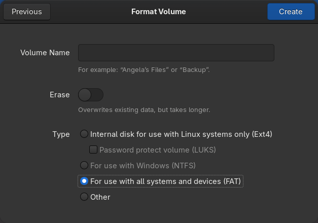

# Omatoki — おまとき

**Clock + Calendar + Weather at a glance** for [Omarchy Quattro](https://omarchy.org).

One panel, everything today:

* **Hero clock** — `15:10`, `Monday`, `September 7` (like your mock)
* **Progress rails** — month `— 68% —`, year, and **life** (double-click year to set birth year / expectancy, like `omarchy.calendar-clock`)
* **Month grid** — always 6 rows, week numbers, chevrons / wheel / `[/]` / arrow keys to step, `T` to today, `W` to toggle Monday/Sunday
* **Weather** — `15°C` hero + `FOCHVILLE` + `FEELS / WIND / HUMID` + 3-day strip, with searchable location (click location → `geocoding-api.open-meteo.com`), `°C/°F` auto (locale + country), and `wttr.in` + `open-meteo` fallback — keeps all `omarchy.weather` functionality

Keeps every `omarchy.clock` behaviour: bar format ring (right-click cycles `dddd HH:mm` → `h:mm AP` → …), vertical bar stack, middle-click → `omarchy-menu-timezone`, `shell.json` persistence.



## Install

```sh
omarchy plugin add https://github.com/compourri/omatoki.git --enable --yes
# bar placement — replaces omarchy.clock in center by default
omarchy bar move io.github.compourri.omatoki --section center
```

Manual:

```sh
mkdir -p ~/.config/omarchy/plugins/io.github.compourri.omatoki
cp -r BarWidget.qml Panel.qml Model.js manifest.json ~/.config/omarchy/plugins/io.github.compourri.omatoki/
quickshell ipc -p /usr/share/omarchy/shell call shell rescanPlugins
omarchy plugin enable io.github.compourri.omatoki
```

## Use

* Click clock → open/close panel (also `omarchy-shell shell summon io.github.compourri.omatoki '{}'`)
* Right-click clock → cycle bar format (persists to `shell.json`)
* Middle-click clock → timezone picker
* `W` / click `W` header → toggle week start Monday ↔ Sunday
* `[/]` / scroll → month, `{/}` / `Shift+Scroll` → year, `T` → today
* Double-click year rail → set `BORN` / `LIVE TO` (life bar hidden until birth year set; double-click life bar to clear)
* Click location → search city (Enter to commit, Up/Down to pick, `×` to clear → IP auto-detect)

## Configure

`shell.json` entry (via bar settings or hand-edit):

```json
{
  "id": "io.github.compourri.omatoki",
  "format": "dddd HH:mm",
  "weekStartDay": "monday",
  "birthYear": 1995,
  "lifeExpectancy": 90,
  "unit": "metric",
  "refreshMinutes": 15
}
```

Weather location lives in `~/.local/state/omarchy/settings/weather.json` (shared with `omarchy.weather` via `omarchy-weather-location`).

## Remove

```sh
omarchy plugin remove io.github.compourri.omatoki
# built-in omarchy.clock comes back automatically
```

## Credits

* Calendar / year / life math from `omarchy.clock/Model.js`
* Weather fetch / geocoding / `open-meteo` + `wttr.in` from `omarchy.weather/Model.js`
* Layout language from `omarchy.clock` + `omarchy.weather` panels

## License

MIT — see [LICENSE](LICENSE).
